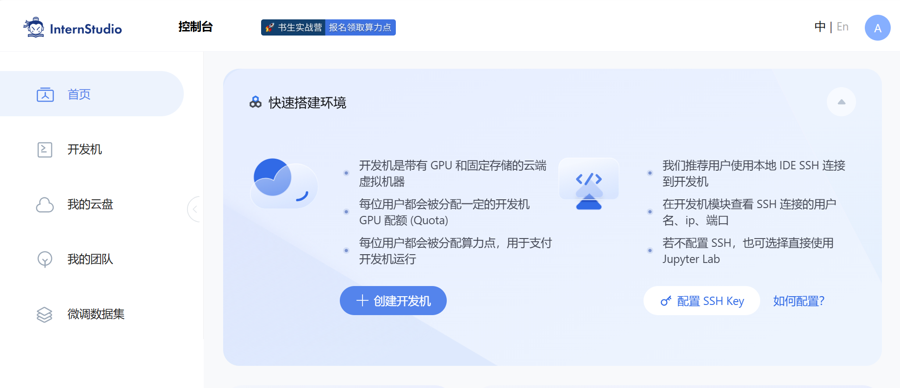
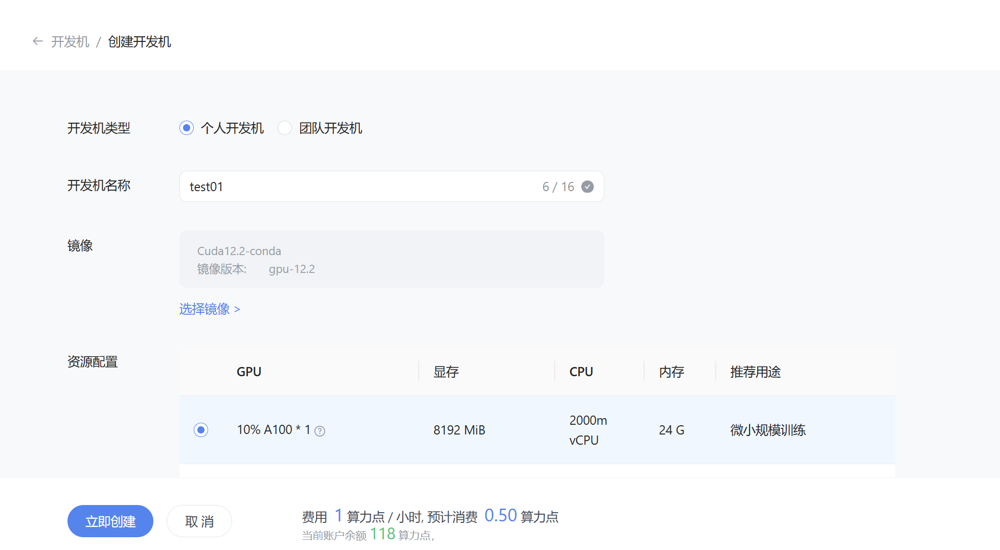
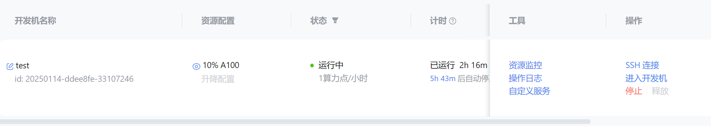
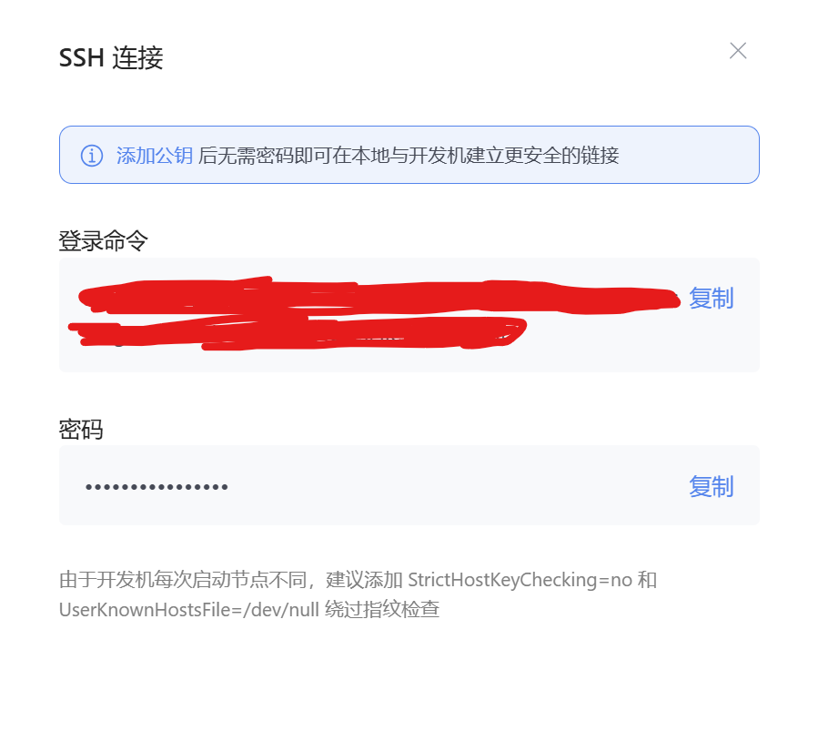
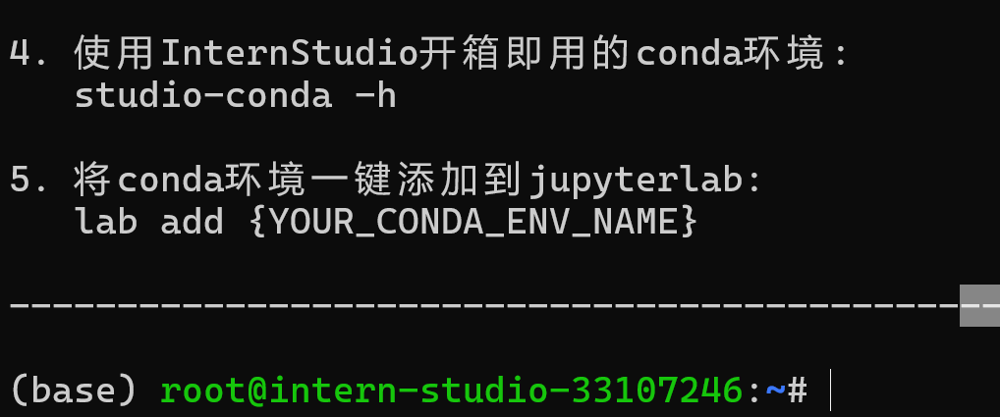
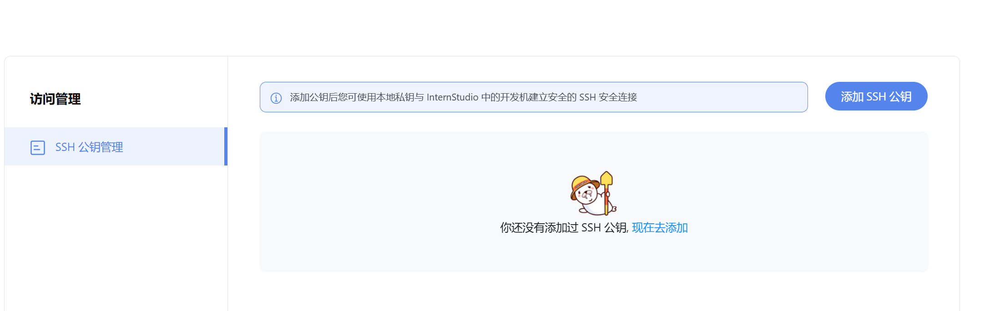
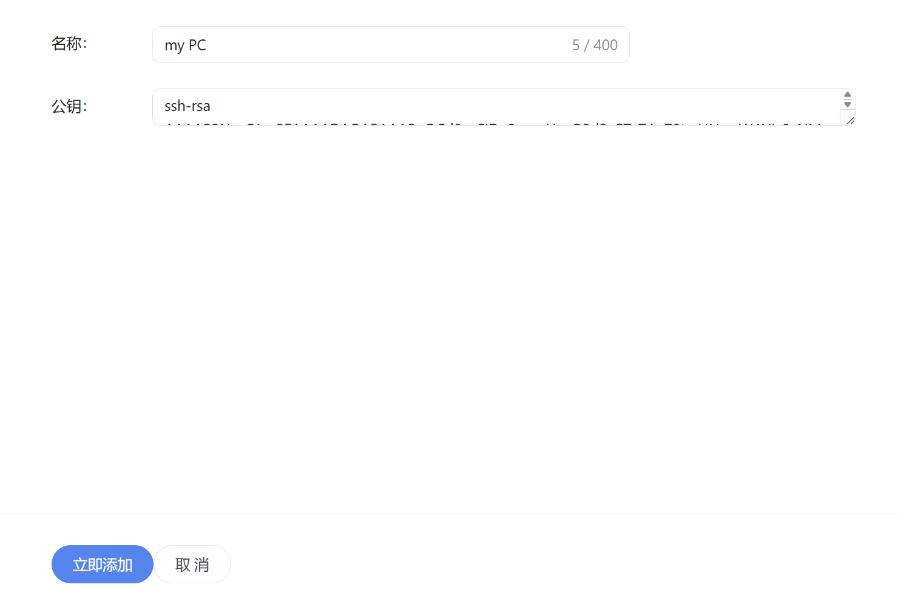
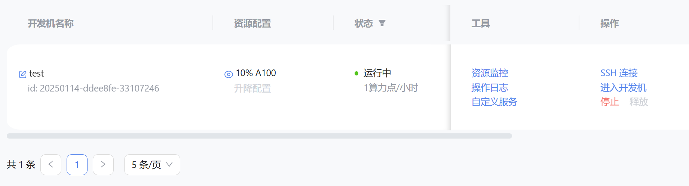

# Linux+InternStudio 关卡
 
点击 **创建开发机**：



设置虚拟机基本信息，点击“**立即创建**”：



点击“**进入开发机**”：




点击“**SSH 连接**”



将登录命令粘贴到本机命令行工具，出现提示输入密码，将密码粘贴到命令行行工具，出现如下画面说明 SSH 连接成功




如果本地有 SSH 密钥，可以跳过，否则在本地命令行工具输入`ssh-keygen -t rsa` 命令，生成 SSH 密钥。

如果是 Windows 则在 `C:\Users\{your_username}\.ssh` 文件夹下，如果是 Linux 则在 `~/.ssh/`，将生成的 `XXXX.pub` 的公钥复制。

进入 [访问管理 https://studio.intern-ai.org.cn/user/access](https://studio.intern-ai.org.cn/user/access) 页面，点击“添加 SSH 公钥”。



为 SSH 定义一个名称，将生成的公钥粘贴到公钥，点击“立即添加”。




如果重开命令行工具，重新进入主机，则可以免密登录。

在服务器输入 `vim hello_world.py`,在 vim 编辑器输入如下内容，并保存：

```python
import socket
import re
import gradio as gr
 
# 获取主机名
def get_hostname():
    hostname = socket.gethostname()
    match = re.search(r'-(\d+)$', hostname)
    name = match.group(1)
    
    return name
 
# 创建 Gradio 界面
with gr.Blocks(gr.themes.Soft()) as demo:
    html_code = f"""
            <p align="center">
            <a href="https://intern-ai.org.cn/home">
                
            </a>
            </p>
            <h1 style="text-align: center;">☁️ Welcome {get_hostname()} user, welcome to the ShuSheng LLM Practical Camp Course!</h1>
            <h2 style="text-align: center;">😀 Let’s go on a journey through ShuSheng Island together.</h2>
            <p align="center">
                <a href="https://github.com/InternLM/Tutorial/blob/camp3">
                    
                </a>
            </p>

            """
    gr.Markdown(html_code)

demo.launch()
```

执行依赖安装命令：`pip install gradio==4.44.1`

运行 `hello_world.py`：`python hello_world.py`
此时命令行出现`Running on local URL:  http://127.0.0.1:7860` 说明脚本运行成功，该脚本的端口是 `7860`。

点击“**自定义服务**”，查看进行端口转发命令。



**在本地命令行工具**运行：`ssh -p 43961 root@ssh.intern-ai.org.cn -CNg -L 7860:127.0.0.1:7860 -o StrictHostKeyChecking=no` 
当出现提示 `Warning: Permanently added '[ssh.intern-ai.org.cn]:43961' (ED25519) to the list of known hosts.` 则说明转发成功。

本地浏览器访问：[http://localhost:7860/](http://localhost:7860/)

如果出现图片加载失败，在浏览器打开新的标签页，访问 https://oss.lingkongstudy.com.cn/blog/202410081252022.png ，再次访问浏览器页面。


