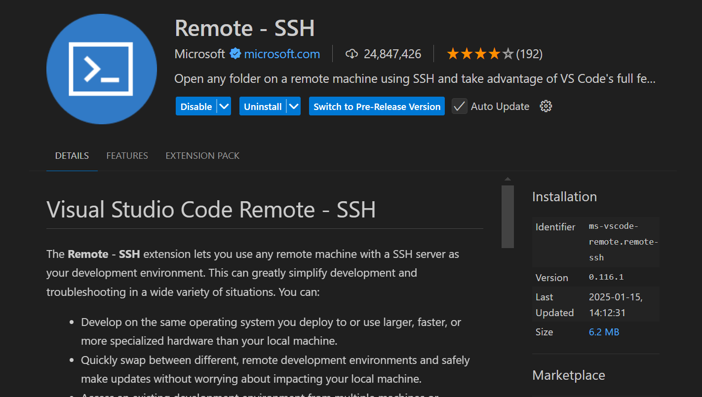
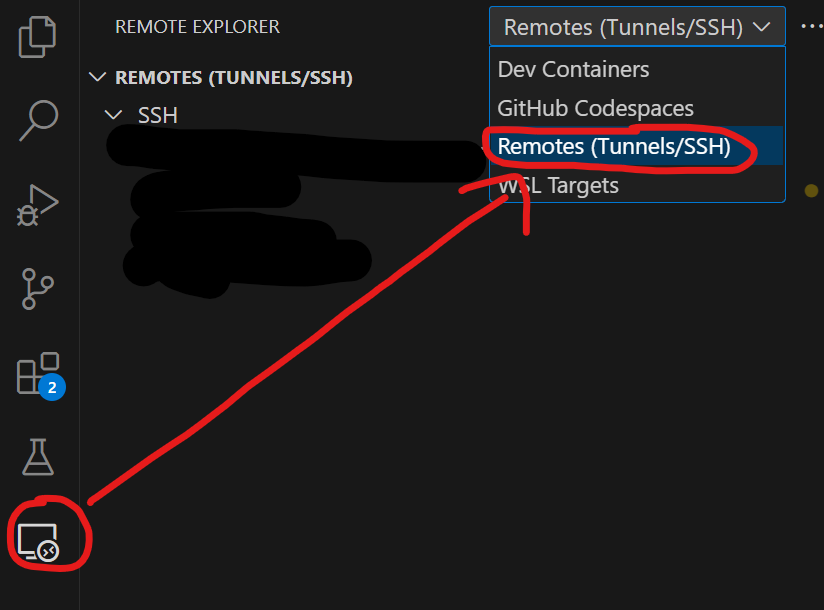
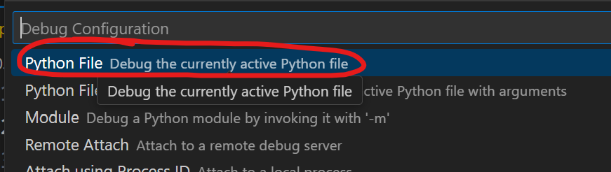
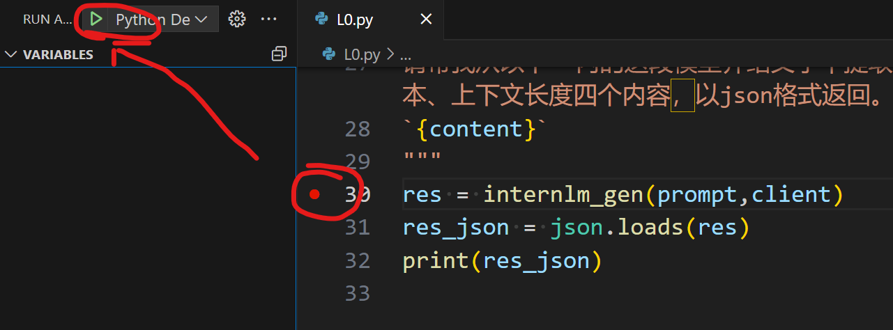

# Python

> 任务二做了很久，还清理了环境，前后文件混用可能文件夹/文件名称不一致。

## 任务一

> 完成[Leetcode 383](https://leetcode.cn/problems/ransom-note/description/), 笔记中提交代码与leetcode提交通过截图


```python
class Solution:

    def canConstruct(self, ransomNote: str, magazine: str) -> bool:

        ransomNoteDict = {};

        magazineDict = {};

        for ransomIndex in ransomNote:

            ransomNoteDict[ransomIndex] = ransomNoteDict.get(ransomIndex, 0) + 1;

        for magazineIndex in magazine:

            magazineDict[magazineIndex] = magazineDict.get(magazineIndex, 0) + 1;

        for key in ransomNoteDict.keys():

           if ransomNoteDict.get(key, 0) > magazineDict.get(key, 0):

               return False

        return True
```


## 任务二
>下面是一段调用书生浦语API实现将非结构化文本转化成结构化json的例子，其中有一个小bug会导致报错。请大家自行通过debug功能定位到报错原因。

获取 API , 进入：[书生·浦语](https://internlm.intern-ai.org.cn/api/tokens) ，点击创建 API token


为 token 取一个名字，点击确认，并复制 key.

打开新的 VScdode 窗口


安装 `Remote - SSH`



切换 `Remotes（Tunnels/SSH）`



在 SSH 点击“+”，在弹出的输入框，粘贴远程机 SSH 连接命令。


等待机器初始化。

点击箭头，进入环境。


安装 python 插件。


打开 Terminal

使用 conda 创建环境

```bash
conda create --prefix /root/envs/myenv python=3.11
```

激活环境
```bash
conda activate /root/envs/myenv
```

创建文件夹
```
mkdir tutorial-python
cd tutorial-python
```

使用 VScode 打开 Demo 文件夹


创建  `L0.py` :

```python
from openai import OpenAI

import json

import os

def internlm_gen(prompt,client):

    '''

    LLM生成函数

    Param prompt: prompt string

    Param client: OpenAI client

    '''

    response = client.chat.completions.create(

        model="internlm2.5-latest",

        messages=[

            {"role": "user", "content": prompt},

      ],

        stream=False

    )

    return response.choices[0].message.content

  

api_key = os.getenv('api_key')

client = OpenAI(base_url="https://internlm-chat.intern-ai.org.cn/puyu/api/v1/",api_key=api_key)

  

content = """

书生浦语InternLM2.5是上海人工智能实验室于2024年7月推出的新一代大语言模型，提供1.8B、7B和20B三种参数版本，以适应不同需求。

该模型在复杂场景下的推理能力得到全面增强，支持1M超长上下文，能自主进行互联网搜索并整合信息。

"""

prompt = f"""

请帮我从以下``内的这段模型介绍文字中提取关于该模型的信息，要求包含模型名字、开发机构、提供参数版本、上下文长度四个内容，以json格式返回。

`{content}`

"""

res = internlm_gen(prompt,client)

res_json = json.loads(res)

print(res_json)
```


安装第三方库 `OpenAI` : 
```
mkdir -p /root/myenvs
pip install openai --target /root/myenvs --root-user-action=ignore
```


创建 `launch.json` 文件：点击 debug 插件，点击 `create a launch.json file` ，选择 `Python debugger`


选择 `Python File(Debug the currently active Python file)`



打断点，通过启动 debug，调出 debug 命令行（此步会报错，主要是调出环境，注入 apikey）：



在 debug 命令行注入密钥
```
export api_key="填入你的api token"
```
再次启动 debug，可以看到返回结果


修改代码如下：
```python
from openai import OpenAI

import json

import os

def internlm_gen(prompt,client):

    '''

    LLM生成函数

    Param prompt: prompt string

    Param client: OpenAI client

    '''

    response = client.chat.completions.create(

        model="internlm2.5-latest",

        messages=[

            {"role": "user", "content": prompt},

      ],

        stream=False

    )

    return response.choices[0].message.content

  

api_key = os.getenv('api_key')

client = OpenAI(base_url="https://internlm-chat.intern-ai.org.cn/puyu/api/v1/",api_key=api_key)

  

content = """

书生浦语InternLM2.5是上海人工智能实验室于2024年7月推出的新一代大语言模型，提供1.8B、7B和20B三种参数版本，以适应不同需求。

该模型在复杂场景下的推理能力得到全面增强，支持1M超长上下文，能自主进行互联网搜索并整合信息。

"""

prompt = f"""

请帮我从以下``内的这段模型介绍文字中提取关于该模型的信息，要求包含模型名字、开发机构、提供参数版本、上下文长度四个内容，请严格以 json 格式返回，如 '{{"model_name":"书生浦语","development_institution":"实验室","parameter_versions":["1.8B"],"context_length":"10M"}}'。

`{content}`

"""

res = internlm_gen(prompt,client)

normalizedStr = res.replace("```json", "").replace("```", "")

res_json = json.loads(normalizedStr)

print(res_json)
```


## 任务三
> 使用VScode连接开发机后使用`pip install -t`命令安装一个numpy到看开发机`/root/myenvs`目录下，并成功在一个新建的python文件中引用。


安装 numpy, 命令行执行：
```bash
conda activate base

pip install numpy -t /root/myenvs --root-user-action=ignore
```

在 `tutorial-python` 创建文件 `hello_numpy.py` :
```python
import sys

your_directory = '/root/myenvs'

if your_directory not in sys.path:
    # 将目录添加到 sys.path  
    sys.path.append(your_directory)

import numpy as np 
x=np.array([1,2,3,4,5,6])
print(x)
```

执行：`python hello_numpy.py`
显示：`[1 2 3 4 5 6]`

## 其他问题

1. 出现 `Import "openai" could not be resolved` , 但 `pip list` 显示已安装 `openai` ：
  ctrl + shift + p，弹出选项框，选择 `Python: Select Interpreter`, 在选择自己的环境。

